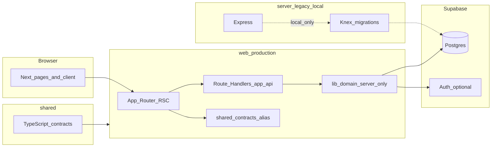

# Architecture

This document describes how **angushallyapp** is structured at runtime and in the repository. For product direction, see `docs/vision.md`. For deep dives on specific choices, see `docs/adr/`. For the colocated Next service pattern, see `docs/guides/service-layer.md`.

**Hosting target (production):** **Vercel** runs **`web` only** (root directory `web`). HTTP APIs are **Next.js Route Handlers** under `web/src/app/api/**`. **Supabase** provides Postgres (and optional Auth). See `docs/guides/heroku-to-vercel-migration.md` and `docs/guides/server-to-next-mapping.md`. ADR `docs/adr/0016-next-supabase-colocated-features.md`.

---

## System overview

The application is a **monorepo** with two workspaces; **production traffic does not run Express**.

| Workspace | Role |
|-----------|------|
| `web` | **Primary:** Next.js 15 (App Router), React 18, Mantine UI, PWA; pages, layouts, **Route Handlers** (`/api`), and **colocated server logic** under `src/lib/<domain>/`. |
| `server` | **Legacy / tooling:** Express, Knex, PostgreSQL migrations, Jest integration tests, and one-off scripts. Used for local integrated dev or migration until Express is fully retired—not deployed on Vercel. |

A **root** `package.json` ties workspaces together and carries shared backend dependencies used when running `server` locally.



---

## Request paths

- **Vercel (canonical):** All `/api/*` requests are handled by **Next Route Handlers** in `web/src/app/api/**/route.ts`. Domain logic lives in `web/src/lib/<domain>/` (server-only imports).
- **Local integrated mode (optional):** If you run the Express app with Next attached (`server/bootstrap/next.js`), Express may still register `/api/*` first. For **production alignment**, do not rely on that path; implement new behavior only in Next + Supabase.

When adding or changing an HTTP API, **default to Route Handlers** in `web` and update `docs/guides/server-to-next-mapping.md` if you add a new surface.

---

## Repository layout (high level)

```
angushallyapp/
├── src/
│   ├── app/              # App Router: pages, layouts, api/**/route.ts
│   ├── lib/              # Server utilities, domain logic (content, habit, supabase, …), API client
│   ├── components/
│   ├── providers/
│   ├── services/         # Typed clients + hooks (fetch /api)
│   └── types/            # App-wide TS types (e.g. navigation)
├── docs/
│   ├── guides/
│   │   ├── heroku-to-vercel-migration.md
│   │   └── server-to-next-mapping.md
│   └── adr/
└── public/
```

---

## Domain contracts (`src/lib/**/contracts.ts`)

List/pagination and entity shapes for content and habit live next to their server modules, e.g. `src/lib/content/contracts.ts`, `src/lib/habit/contracts.ts`, with shared pagination meta in `src/lib/contracts/pagination.ts`. Route Handlers, `src/lib/*/Repository` modules, and `src/services/*/client.ts` + hooks import these types.

See `docs/guides/service-layer.md`.

---

## Frontend (Next.js app root)

- **Routing:** App Router (`src/app`). Metadata, layouts, and server components follow Next 15 patterns.
- **UI:** Mantine v8, Tabler icons, Framer Motion; PWA via `next-pwa` (`next.config.mjs`).
- **Data access:** `src/services/<feature>/` exposes **clients** and **hooks** so components avoid ad hoc `fetch`.
- **Browser HTTP:** `src/lib/api/client.ts`, `src/lib/http/httpStatusMessage.ts`.
- **Auth:** Supabase Auth when enabled; `AuthProvider` may wrap session (see ADRs 0007 / 0009 / 0016).

Path alias **`@/*`** resolves to `src/*`.

---

## Backend legacy (`server`)

- **Purpose:** Knex migrations against Postgres/Supabase, Jest route/service tests, optional local Express.
- **Sunset:** Once DDL and tests move to Supabase + Vitest, trim or archive `server/` bootstrap for production workflows. Vercel **never** runs `server/index.js`.

---

## Data and migrations

- Schema workflow: `docs/guides/database.md`, `docs/guides/database-schema.md`.
- Apply DDL with your normal process (e.g. **Supabase** `supabase db push`).

---

## Configuration and secrets

- **Vercel / Next:** `NEXT_PUBLIC_*` for browser; `SUPABASE_URL`, `SUPABASE_SERVICE_ROLE_KEY`, `NEXT_PUBLIC_SUPABASE_ANON_KEY`, OpenAI, SMTP, etc., as server-only env vars in the Vercel project.
- **Local Express:** `server/config/` when running the legacy server.

---

## Testing

| Area | Tooling | Location |
|------|---------|----------|
| Next app | Vitest, Testing Library | `src/**/*.{test,spec}.{ts,tsx}`; shared setup `src/test/setup.ts` |
| Server (legacy) | Jest, Supertest | `server/tests/` (if present in older checkouts) |

---

## Related documentation

| Topic | Document |
|-------|----------|
| Service layer (colocated Next) | `docs/guides/service-layer.md` |
| Express → Next mapping | `docs/guides/server-to-next-mapping.md` |
| Vercel migration chunks | `docs/guides/heroku-to-vercel-migration.md` |
| Doc index | `docs/README.md` |
| Vision & strategic goals | `docs/vision.md` |
| Backlog & tech debt | `docs/backlog.json` |
| Colocation decision | `docs/adr/0016-next-supabase-colocated-features.md` |
| Next migration | `docs/adr/0013-nextjs-migration.md` |
| Next migration history (plan/tracker/log) | `docs/adr/0018-nextjs-migration-history.md` |

---

## Maintenance

When you change API boundaries, hosting, or workspace roles, update this file and `docs/guides/server-to-next-mapping.md` in the same change.
