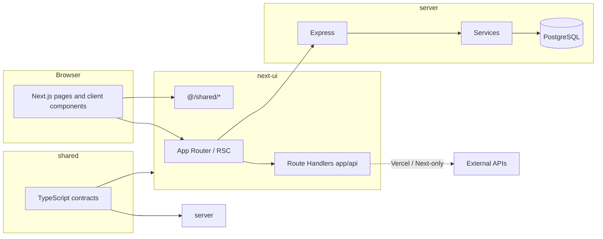

# Architecture

This document describes how **angushallyapp** is structured at runtime and in the repository. For product direction, see `docs/02_roadmap.md`. For deep dives on specific choices, see `docs/adr/`. For the content/habit service pattern, see `docs/service-layer.md`.

---

## System overview

The application is a **monorepo** with two primary workspaces:

| Workspace | Role |
|-----------|------|
| `next-ui` | Next.js 15 (App Router), React 18, Mantine UI, PWA; pages, layouts, and selected API route handlers |
| `server` | Node.js **Express** API, Knex, PostgreSQL migrations, domain services, and observability helpers |

A **root** `package.json` ties workspaces together and still carries some shared backend dependencies used by `server`.



---

## Request paths: Express vs Next route handlers

- **Integrated server (e.g. single process with Next prepared):** Express registers `/api/*` routes first (`server/bootstrap/routes.js`). The Next request handler is attached as a catch‑all afterward (`server/bootstrap/next.js`), so **registered Express APIs take precedence** for those paths.
- **Next-only hosting:** Requests hit **Next.js Route Handlers** under `next-ui/src/app/api/**/route.ts` when present. Some handlers are thin or temporary (for example, content list/detail may return a migration stub); production behavior depends on which stack is fronting traffic.

When adding or changing an HTTP API, confirm whether the live deployment uses the **Express** router, **Next** handlers, or both, and keep behavior aligned.

---

## Repository layout (high level)

```
angushallyapp/
├── next-ui/                 # Frontend + Next API routes
│   ├── src/app/             # App Router: pages, layouts, route.ts handlers
│   ├── src/components/      # React components
│   ├── src/lib/             # Server/client utilities (email, validation, etc.)
│   ├── src/providers/       # e.g. AuthProvider
│   ├── src/services/        # Domain clients + hooks (content, habits, …)
│   └── src/shared/          # API client, HTTP helpers, shared TS types
├── server/                  # Express application
│   ├── bootstrap/           # createApp, routes, middleware, Next attachment
│   ├── routes/              # HTTP routers (many accept injected services)
│   ├── services/            # contentService, habitService, …
│   ├── migrations/          # Knex migrations
│   ├── middleware/          # Auth and cross-cutting HTTP concerns
│   └── observability/       # Logger, errors, request context
├── shared/                  # Cross-package TypeScript contracts
│   └── services/
│       ├── contracts/       # e.g. pagination types
│       ├── content/
│       └── habit/
└── docs/                    # ADRs, runbooks, this file
```

---

## Shared contracts (`shared/`)

Type definitions for list/detail payloads and pagination live under `shared/services/**` so **Next UI** and **server** can agree on shapes without duplicating types. In `next-ui`, the alias `@shared/*` maps to this tree (`next-ui/tsconfig.json`).

**Convention:** add new domain types under `shared/services/<domain>/contracts.ts`, implement server logic in `server/services/<domain>Service.js`, expose HTTP via `server/routes/<domain>Route.js`, and consume from `next-ui/src/services/<domain>/client.ts` and `hooks.ts`. See `docs/service-layer.md` for the full checklist.

---

## Frontend (`next-ui`)

- **Routing:** Next.js App Router (`src/app`). Metadata, layouts, and server components follow Next 15 patterns.
- **UI:** Mantine v8, Tabler icons, Framer Motion where needed; PWA via `next-pwa` (`next.config.mjs`).
- **Data access:** Feature modules under `src/services/<feature>/` expose **clients** (fetch) and **hooks** (React) so pages and components avoid ad hoc `fetch` to scattered URLs.
- **Shared HTTP:** `src/shared/apiClient.ts` centralizes JSON `fetch` to `/api`, error mapping, and `ApiError`. Status-to-message copy lives in `src/shared/http/httpStatusMessage.ts`.
- **Auth:** `AuthProvider` and related utilities under `src/providers/` and `src/shared/authUtils.ts` (see ADR 0007 / 0009 for strategy).

Path alias **`@/*`** resolves to `next-ui/src/*`.

---

## Backend (`server`)

- **Composition:** `createApp` wires middleware, route registration, and health checks (`server/bootstrap/createApp.js`). `createServer` optionally attaches the Next handler for combined deployments (`server/bootstrap/createServer.js`).
- **Routes:** Mounted under `/api/...` (contact, content, habit, auth, bookmarks, strava, raindrop, instagram-intelligence, etc.). Several routers are **factories** that receive services for testing and DI (`server/bootstrap/routes.js` + `loadRoute`).
- **Data:** PostgreSQL via Knex (`server/db.js`, `server/knexfile.js`, `server/migrations/`).
- **Observability:** Structured logging and error helpers under `server/observability/`.

---

## Data and migrations

- Schema and migration workflow are documented in `docs/05_database.md` and `docs/04_schema.md`.
- Migrations are the source of truth for DDL; apply them against the target database with your normal process (for example remote Supabase via `supabase db push` if that is your environment).

---

## Configuration and secrets

- **Server:** `server/config/` validates and exposes environment-driven settings.
- **Next:** Public env vars use `NEXT_PUBLIC_*`; sensitive values stay server-only. `next.config.mjs` can expose selected keys to the client (e.g. reCAPTCHA site key pattern).

---

## Testing

| Area | Tooling | Location |
|------|---------|----------|
| Next UI | Vitest, Testing Library | `next-ui/tests/` |
| Server | Jest, Supertest | `server/tests/` |

Run from each workspace as documented in `README.md` / `next-ui` and `server` READMEs.

---

## Related documentation

| Topic | Document |
|-------|----------|
| Service layer pattern | `docs/service-layer.md` |
| Doc index | `docs/01_guidance.md` |
| Tech stack decision | `docs/adr/0001-tech-stack.md` |
| Next migration | `docs/adr/0013-nextjs-migration.md` |
| API routing (Express) | `docs/adr/0005-api-routing-pattern.md` |
| Hosting / platform moves | `docs/migration/heroku-to-vercel.md`, `docs/14_hosting_mirgation_plan.md` |

---

## Maintenance

When you change boundaries (new `/api` surface, new workspace, or deployment target), update this file in the same change so agents and contributors keep a single accurate structural picture.
